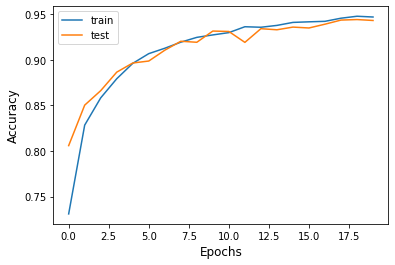

# SCREAM  DETECTOR

## Datos del curso 📘

 **Proyecto final**
* **Curso: TÉCNICAS AVANZADAS DE DATA MINING Y SISTEMAS INTELIGENTES**
* **Clase del 2020-1**
* **Maestría en informática - Mención en ciencias de la computación**

## Objetivo 🎯

El proyecto tiene como objetivo la detección de gritos humanos en audios que están basados en sonidos de máquinas o herramientas en funcionamiento encontradas en el conjunto de datos UrbanSound8K. Para el proyecto se añadirá a este conjunto de datos sonidos que resulten de la fusión del conjunto original con gritos humanos, procedentes de otros conjuntos de datos, y se buscará determinar con un modelo en que audios se encuentran gritos y en cuáles no.

Para la aplicación se entrenaron 2 modelos: CNN y LSTM. A continuación se presenta los resultados del entrenamiento de la CNN para el accuracy con los sets de entrenamiento y validación:

<p align="center"> 
    
</p>

## Arquitectura y estructura de archivos 🏢

El proyecto cuentas con las siguientes carpetas:

📁 PRESENTACION PARCIAL ([Ver](/PRESENTACION%20PARCIAL)) .- Contiene los archivos que formaron parte de la presentación parcial del trabajo que inspiro este proyecto. Se cuenta con la presentación en PDF y el modelo en un Python Notebook

📁 ENUNCIADO PROYECTO ([Ver](/ENUNCIADO%20PROYECTO)) .- Contiene el archivo con la propuesta del proyecto.

📁 MEZCLA DE AUDIO ([Ver](/MEZCLA%20DE%20AUDIO)) .- Contienen los scripts que se utilizaron para realizar la mezcla de los audios base con los gritos. En la acción de generar las mezclas se etiqueto el tiempo exacto en el que comienza el grito y se estandarizo que el mismo sea de 1s. Se presenta tambien Base.wav y Grito.wav como representantes de un audio base obtenido del dataset Urban Sound 8K y los datasets de gritos respectivamente.

📁 MODELOS ([Ver](/MODELOS)) .- En esta carpeta se almacenan los cuadernos con las experimentaciones hechas con distintos modelos usando los datasets de audios mezclados. 

📁 MODELOS FINALES ([Ver](/MODELOS%20FINALES)) .- En esta carpeta hemos almacenado los modelos con mejor performance en las pruebas, estos contienen gráficas de su entrenamiento y un archivo donde se ponen a prueba.

📁 IMAGENES ([Ver](/IMAGENES)) .- Contiene algunas imagenes usadas en este archivo.

## Pasos para ejecución (Jupyter Notebook) 🐍 

- Clonar el proyecto, usar:
```sh
git clone https://github.com/fararay/Scream_Detector.git
```
- Instalar las dependencias requeridas por el cuaderno que usted desee ejecutar.
```sh
# Instalamos las dependencias del proyecto
!pip install xxxxxxxx'
```
- Descargar los datasets solicitados pòr el cuaderno de los enlaces listados a continuación.

- Ejecutar el cuaderno.

## Datasets usados en el proyecto 📑

- Dataset de audios mezclados ([Dataset](https://drive.google.com/file/d/10fvtPNQSeElk9dZmjfN97zG_BevoSP0h/view?usp=sharing)) ([Etiquetas](https://drive.google.com/file/d/12pkM6s9LmJf-sbcY3ap_o9VSMz-1esuc/view?usp=sharing))

- Dataset compilación de gritos ([Dataset](https://drive.google.com/file/d/12TLE5B_I8sVAYbrrZub9EHXTOZ6_8S71/view?usp=sharing)) 

- Dataset habla humana no gritos ([Dataset](https://drive.google.com/file/d/1s-JiZqbsYvBQOuEY6TxH03_7uJiXIvlY/view?usp=sharing)) 

- Dataset de audios base UrbanSound8K ([Dataset](https://zenodo.org/record/1203745/files/UrbanSound8K.tar.gz)) 

## Autores: 💻

<p align="center"> 
    
</p>

* **Juan Manuel Mendoza Jacinto** - [Linkedin](https://pe.linkedin.com/in/juan-manuel-mendoza-jacinto-18515ab0) - [Github](https://github.com/fararay)

* **Jose Ulises Morales Pariona** - [Linkedin](https://pe.linkedin.com/in/juan-manuel-mendoza-jacinto-18515ab0) - [Github](https://github.com/ulises968)

* **Percy Kim Tippe Quintanilla** - [Linkedin](https://www.linkedin.com/in/percy-tippe-1713048/?originalSubdomain=pe) - [Github](https://github.com/fararay)

## Licencia 📄

La licencia de este proyecto es del tipo **GNU General Public License v3.0** ([Ver](LICENSE.md))


